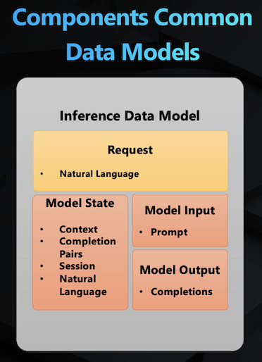
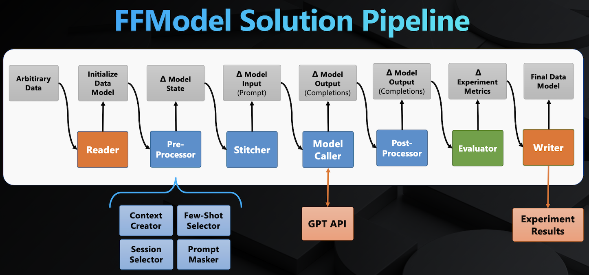
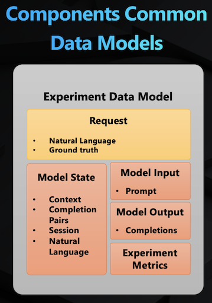

# FFModel Components

In FFModel, a component is a codified step in your machine learning solution.
In addition to its code, a component can have configurations and supporting data as input.
The configurations are used to initialize and customize the execution of the component,
while the supporting data captures the supporting data files required by component to execute.

There are three types of components:

- **Reader Components** - a type of component that loads arbitrary data into  FFModel data models. This is the starting point for experimentation and inference workflows. But, it's not captured as part of your solution component sequence, as it can be different for experimentation and inference.
- **Solution Components** – the primary component type that defines your solution, these include pre-processors that tackle prompt engineering, model callers to invoke the LLM, and other solution needs.
- **Writer Components** – a type of component that takes FFModel data models as input and produces arbitrary outputs. This type of components is not captured as part of your solution components sequence, as it can be different for experimentation and inference.

This guide explains the FFModel component types, their interfaces and how to implement your own components.

## FFModel Data Models

FFModel relies on its own data models to pass through your solution's components.
The main data model is the `InferenceDataModel`:



- `Request` holds the input request for the solution, this holds the user NL prompt, session info, and complementary data. This should not be modified by the components.
- `Model State` holds the state being manipulated by the components in preparation to call the LLM.
- `Model Input` holds the prompt that will be fed into the LLM. This is expected to be built using the model state.
- `Model Output` holds the output from the LLM.

This mimics how a solution is structured as [discussed earlier](../../README.md#getting-started-with-ffmodel), first, the pre-processors accumulate information in the model state in isolation of the model input (prompt).
Then the stitcher component needs to know how to consume all of that information and stitch them together to produce the actual model input to be fed into the model caller.
And so on and so forth.
To view the FFModel data models, you can see their definition using your IDE or in the [FFModel GitHub repo](https://github.com/microsoft/ffmodel/blob/main/ffmodel/data_models/base.py).

## Reader Components

The goal behind the reader components is to give you the flexibility to define how to consume your arbitrary data from files or systems,
then feed them into an FFModel solution, either for experimentation or inference.
The output from a reader component is a `List[Dict[str, Any]]`

### Imports

Reader components need to extend the FFModel `BaseReaderComponent`.

```python
from ffmodel.components.base import BaseReaderComponent
```

### Reader Class

Your reader component module **must** have a class called `Reader` that extends the `BaseReaderComponent` class.
You can check the [reader component template](../../components/reader_template.py) for a bare bone reader definition.

There are two methods to implement:

- `_post_init` this optional method is executed once during the initialization of your reader. This is a good place to consume the configurations you declare in your [solution config](./solution_config.md#component-config).
- `load_data` this required method that loads your data from your source into a list of dictionaries. Each dictionary corresponds to an instance of the FFModel data model. The keys in this dictionary need to adhere to your data model definition.

## Solution Components

Within FFModel, solution components follow a well-defined contract that operates on data models.
This section will cover the contract.

### Imports

Components need to extend the FFModel `BaseSolutionComponent` and declare the data model interface for the component to be implemented.
The following import statements include the `BaseSolutionComponent` and the `InferenceDataModel` in your module.

```python
from ffmodel.components.base import BaseSolutionComponent
from ffmodel.data_models.base import InferenceDataModel
```

If you are implementing an experimentation component, you will need to import the `ExperimentDataModel`.
More on this in the [inference vs experimentation section.](#experimentation-vs-inference)

### Component Class

Your component module **must** have a class called `Component` that extends the `BaseSolutionComponent` class.
You can check the [component template](../../components/component_template.py) for a bare bone component definition.

There are two methods to implement:

- `_post_init` this optional method is executed once during the initialization of your component. This is a good place to connect with your dependencies and consume any inputs you need for your component, such as configurations and supporting data. In our example, we will pass the webpage URL as a config.
- `execute` this required method holds the core logic for your component, this will run on each request coming through your solution. This method takes an `InferenceDataModel` instance as input and is expected to return it as output.

The `BaseSolutionComponent` also has the `execute_batch` method that is used to execute across batches of data models. By default, `execute_batch` is implemented as a for-loop, but you can define custom batch execution logic by overriding the `execute_batch` method per component (optional).

### Types of Solution Components

The follow diagram shows the structure of an FFModel solution:



The blue and green boxes are solution components that we expect you will need to implement as part of your solution. Here is a description of each type:

- **Pre-processors** – a component that gathers and modifies information to be used in constructing the LLM prompt. Pre-processors will generally work off of information available in the original Request (except the ground truth) and prepare information in the Model State of the Data Model for later consumption.
  - Examples: few-shot selectors, prompt maskers, context selectors, etc
- **Stitchers** – a component that takes the information collected in the Model State of the Data Model and stitches this information into a single string prompt (the Model Input), following a templated format defined in the stitcher component logic.
- **Model Caller** – a component that makes the call to the LLM; uses the prompt available in Model Input and outputs completions to the Model Output of the Data Model
- **Post Processors** – a component that post-processes the completion output by the LLM (modifies Model Output in place)
  - Examples: completion unmaskers, completion discriminator (in event that multiple completions are returned), language normalizers (e.g. named args vs. positional args)
- **Evaluators** – an experimentation component that compares the final post-processed Model Output completions against the ground truth provided in the experiment request
  - Examples: Syntax validators, Levenshtein distance-based text similarity, Rouge score text similarity, other measures corresponding to the business objective

Reader and Writer components are covered separately.

## Writer Components

Writer components give you the flexibility to store out additional output data after running your solution whether in experimentation or inference workflows.
For example, you can use a writer component to dump your evaluation metrics as a file.
Or publish your results elsewhere for you and your team to consume.
Your solution can have multiple writers executed in the order they are listed in your solution config, due to that your output will take an FFModel data model as input and it needs to pass it on as output.
If you are using a writer for inference, be aware of the performance impact that it will have on each request.

### Imports

Writer components need to extend the FFModel `BaseWriterComponent`.

```python
from ffmodel.components.base import BaseWriterComponent
```

### Writer Class

Your writer component module **must** have a class called `Writer` that extends the `BaseWriterComponent` class.
You can check the [writer component template](../../components/writer_template.py) for a bare bones writer definition.

There are two methods to implement:

- `_post_init` this optional method is executed once during the initialization of your writer. This is a good place to consume the configurations you declare in your [solution config](./solution_config.md#component-config).
- `execute` similar to solution components, this method is required and will be executed on each data model coming through your solution. This holds the core logic to write your outputs.

## Pre-packaged Components

Your project gets initialized with some [components](../../components/).
Please check those components to learn more about how to implement your components.
You can also check the [creating an FFModel solution](./creating_solutions.md) on how to implement a component.

## Handling Supporting Data In the Cloud

When running the FFModel solution on the cloud, FFModel automatically checks if your component takes supporting data and then it uploads them to AML as datasets.
It also automatically download them when needed for AML experimentation and inference.

## Experimentation vs Inference

As mentioned earlier, there are key differences between the flow for experimentation and inference.
For instance, in experimentation, you will most likely compute evaluation metrics to assess the performance of your solution.
As discussed earlier, these metrics are computed within evaluator components.

Such components are not needed for the inference flow.
FFModel distinguishes between the two different flows using different data models,
the `InferenceDataModel` is used to indicate that a component is a core component shared between both flows.
On the other hand, the `ExperimentDataModel` is used to indicate that this component is only needed in the experimentation flow.

The orchestration logic within FFModel includes all components when orchestrating an experiment,
when orchestrating inference, it only includes the components that uses the `InferenceDataModel`.

### Experimentation Data Models

The experimentation data models extend the inference data model with additional attributes needed only during experimentation.
Such as evaluation metrics.
The diagram below captures the structure of the `ExperimentDataModel`:



### Imports

Use the following imports for components that you only need for experimentation (i.e., evaluators, writers):

```python
from ffmodel.components.base import BaseSolutionComponent
from ffmodel.data_models.base import ExperimentDataModel
```

This kind of component is meant to help you capture your experiment outputs.
FFModel provides a JSONL writer (`components.writers.jsonl`) that uploads your FFModel data model as a JSONL file to AML.
It also captures it as an output artifact in your AML job.
