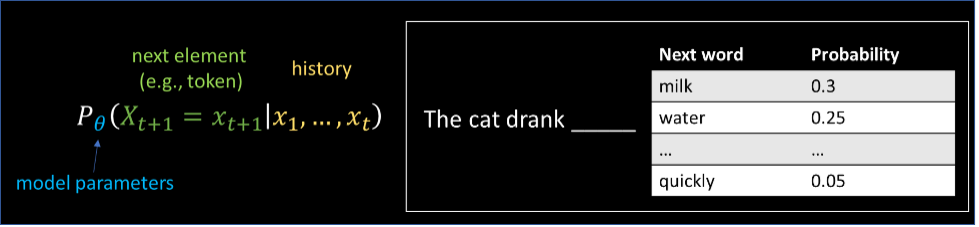

# Outline

This guide aims to provide users with comprehensive resources and learnings for Large Language Model (LLM) applications covering the following topics:

- **Introduction**
  - [LLMs Overview](#overview-of-llms)
  - [Prompt Engineering](./prompt_engineering.md)
  - [Fine Tuning](./fine_tuning.md)
  - [Evaluation Metrics](./evaluation_metrics.md)
- **Recommendations and Learnings**
  - [Experimentation](./experiment_recommend.md)
  - [Use Cases](./use_case_recommend.md)
  - [Prompt Engineering](./prompt_engineering_recommend.md)
  - [Fine-Tuning](./fine_tuning_recommend.md)

## Overview of LLMs

Large Language Models (LLMs) are deep learning models trained using large text corpus to generate text. They are based on the idea of auto-regressive models, where they have been trained to predict the next word (or the most probable ones) given the previous ones. LLMs can be used to process large amounts of text and learn the structure and syntax of human language.

*
Figure 1: LLMs as auto-regressive models
*

The development of LLMs has been a gradual process, especially over the past decade. The first LLMs were relatively small and could only perform simple language tasks. However, with the advances seen in developing deep neural networks, such as the introduction of transformers, and the availability of vast amounts of data, larger and more powerful LLMs were created. The figure below shows examples of LLMs that have been introduced over the past few years with their sizes.

*
Figure 2: Evolution of LLMs over the past few years. The graph shows a trend of 10x increase in size annually
*

In 2020, the release of the [GPT-3](https://arxiv.org/abs/2005.14165) (Generative Pre-trained Transformer 3) model, which also represents a family of models with different sizes, marked a significant milestone in the development of LLMs, as it demonstrated the ability to generate coherent and convincing text that was difficult to distinguish from text written by humans.

Like other foundation models, LLMs such as GPT-3 are trained in a self-supervised/unsupervised manner and can be adapted to perform different tasks and/or applications. This is in contrast to traditional machine learning models where different models are trained for different tasks using labeled data. For example, LLMs can be used to generate text for chat-bots, language translation, and content creation. They can also be used to analyze and summarize large amounts of text data, such as news articles or social media posts. In addition, LLMs can be used to write programming code from natural language requests.

Adapting the LLMs for different tasks or applications can be done in two ways: in-context learning through [prompt engineering](./prompt_engineering.md) or [fine-tuning](./fine_tuning.md). Regardless of the approach to be used, there are different techniques, considerations, and best practices that developers and data scientists are encouraged to learn about and adopt.
