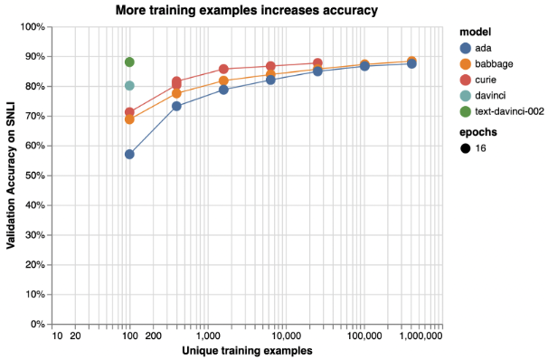

# Fine-Tuning

## What is LLMs Fine-Tuning?

Large Language Model (LLM) Fine-tuning is the process of adapting the pre-trained model to specific tasks by updating its parameters through training on a new dataset. Specifically, the LLM is partially retrained using <input, output> pairs of representative examples of the desired behavior. Hence, it involves updating the model (i.e., LLM) weights. This is related to traditional transfer learning from the deep learning field.

## Data Requirements for Fine-Tuning

Before fine-tuning a large language model (LLM), it is essential to understand some of the data (i.e., training and validation) requirements. Below are a few guidelines:

- **Use a large dataset** –the size of the dataset depends on the complexity of the task and the model being fine-tuned, but generally, you want to have thousands or tens of thousands of examples. Larger models can learn more with less data, as illustrated in the examples in the figure below, but they still need enough data to avoid over-fitting or forgetting what they learned from the pre-training phase.
  
<p align="center"></p>

*<p align="center">Figure 7: Illustrative examples of text classification performance on the [Stanford Natural Language Inference (SNLI) Corpus](https://paperswithcode.com/dataset/snli/), in which ordered pairs of sentences are classified by their logical relationship: either contradicted, entailed (implied), or neutral. Default fine-tuning parameters were used when not otherwise specified.</p>*

- **Use a high-quality dataset** – the dataset should be consistently formatted and cleaned of incomplete or incorrect examples.
- **Use a representative dataset** –the contents and format of the fine-tuning dataset should be representative of the data upon which you’ll use your model. For example, if you are fine-tuning a model for sentiment analysis, you want to have data from different sources, genres, and domains, that reflect the diversity and nuances of human emotions. You also want to have a balanced distribution of positive, negative, and neutral examples, to avoid skewing the model’s predictions.
- **Use a domain-specific and descriptive dataset** –the dataset should contain enough information in the input to generate what you want to see in the output. For example, if you are fine-tuning a model for email generation, you want to provide clear and specific prompts, such as keywords, questions, or contexts, that guide the model’s creativity and relevance. You also want to define the expected length, style, and tone of the email.

## Data Formatting for Fine-Tuning

To fine-tune a model using Azure OpenAI (or OpenAI), you'll need a set of training examples that have certain formats. Please refer to [Azure OpenAI Fine-Tuning Doc](https://learn.microsoft.com/en-us/azure/cognitive-services/openai/how-to/fine-tuning?pivots=programming-language-studio) for more details. Below are some guidelines:

- The training examples should be provided in JSON format, where each example consists of a <*prompt*, *completion*> pair. The prompt is a text fragment that you want the model to continue, and the completion is a possible continuation that the model should learn to produce. For example, if you want to fine-tune an LLM for story generation, a prompt could be the beginning of a story, and a completion could be the next sentence or paragraph.
- To inform the model when the prompt ends and the completion begins, and when the completion ends, you should try a fixed separator and a stop sequence. A separator is a special token or symbol that you insert at the end of the prompt, and a stop sequence is a special token or symbol that you insert at the end of the completion. For example, you could use ```\n##\n``` as the separator and ```\n###\n``` as the stop sequence, as shown below:

```text
  {"prompt": "Alice was beginning to get very tired of sitting by her sister on the bank, and of having nothing to do.\n##\n", 
  "completion": "She wondered if they should just go back home.\n###\n"}
```

- The separator and the stop sequence should not appear in any prompt or completion, as they could confuse the model or interfere with the generation. You should also make sure that your prompts and completions are consistent in terms of style, tone, and length, and that they match the task or domain you want to fine-tune the model for.
- At inference, that is, when you want to use the fine-tuned model to generate new texts, you should format your prompts in the same way as you did when creating the training dataset, including the same separator.

## Fine-Tuning Hyper-parameters

When fine-tuning a large language model such as GPT-3, it is important to adjust hyper-parameters to optimize the performance of the model on a specific task or domain. A number of hyper-parameters are available for the user to adjust when fine-tuning a model (e.g., using Azure OpenAI Studio). The table below lists some of these parameters with some recommendations. ([Source:Best practices for fine-tuning GPT-3 to classify text](https://github.com/openai/openai-cookbook))

| Parameter                  | Description                                                                                                    | Recommendation                                                                                                                                       |
|----------------------------|----------------------------------------------------------------------------------------------------------------|------------------------------------------------------------------------------------------------------------------------------------------------------|
| **n_epochs**                   | Controls the number of epochs to train the model for. An epoch refers to one full cycle through the training dataset. | • Start from 2-4  <br/>• Small datasets may need more epochs and large datasets may need fewer epochs. <br/> • If you see low training accuracy (under-fitting), try increasing n_epochs. If you see high training accuracy but low validation accuracy (over-fitting), try lowering n_epochs. |
| **batch_size**                 | Controls the batch size, which is the number of examples used in a single training pass.                          | • Recommendation is set the batch size in the range of 0.01% to 4% of training set size.  <br>• In general, larger batch sizes tend to work better for larger datasets.                                                                       |
| **learning_rate_multiplier**  | Controls learning rate at which the model weights are updated. The fine-tuning learning rate is the original learning rate used for pre-training, multiplied by this value. | • Recommendation is experiment with values in the range 0.02 to 0.2 to see what produces the best results. <br />• Larger learning rates often perform better with larger batch sizes. <br />• learning_rate_multiplier has minor impact compared to n_epochs and batch_size. |
| **prompt_loss_weight**         | Controls how much the model learns from prompt tokens vs completion tokens.                                      | • If prompts are extremely long (relative to completions), try reducing this weight (default is 0.1) to avoid over-prioritizing learning the prompt.  <br>• prompt_loss_weight has minor impact compared to n_epochs and batch_size. |

## Challenges and Limitations of Fine-Tuning

Fine-tuning large language models can be a powerful technique to adapt them to specific domains and tasks. However, fine-tuning also comes with some challenges and disadvantages that need to be considered before applying it to a real-world problem. Below are a few of these challenges and disadvantages.

- Fine-tuning requires high-quality, sufficiently large, and representative training data that matches the target domain and task. Sometimes it is cost-prohibitive to gain this kind of training data.
- Fine-tuning large language models comes with additional costs associated with training and hosting the custom model. See [Azure OpenAI Pricing](https://azure.microsoft.com/en-us/pricing/details/cognitive-services/openai-service/) for more details.
- Formatting of input/output pairs that are used to fine-tune a large language model can be critical to its performance and usability.
- Fine-tuning may need to be repeated whenever the data is updated, or when an updated base model is released. Therefore, fine-tuned models may need to be monitored and updated regularly.
- Fine-tuning is a repetitive task (trial and error) and the hyper-parameters need to be set carefully. Therefore, fine-tuning requires a lot of experimentation and testing to find the best combination of hyper-parameters and settings that can achieve the desired performance and quality.
