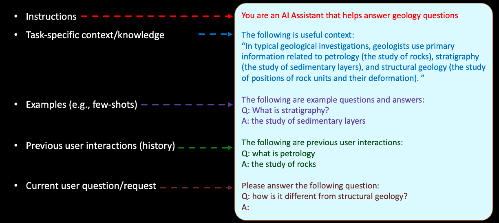
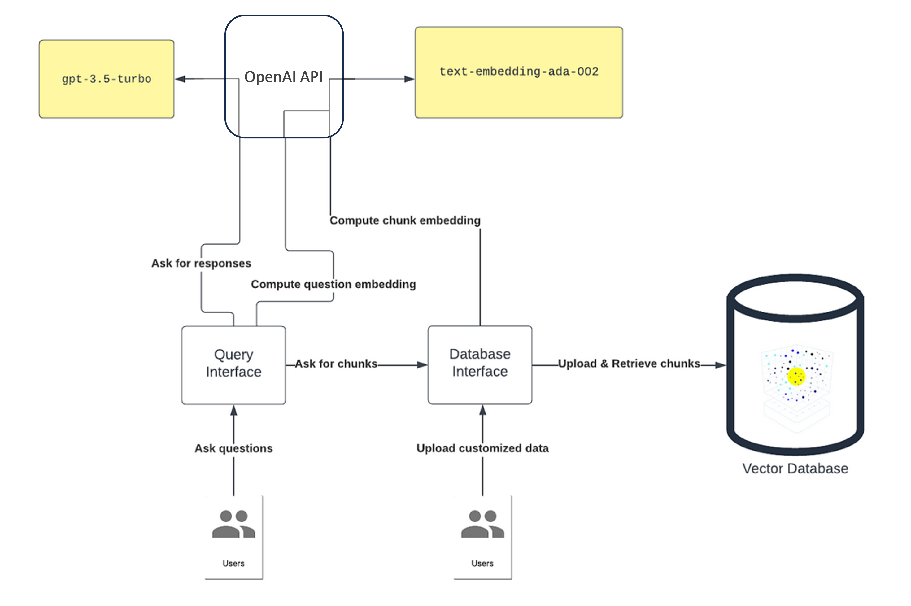
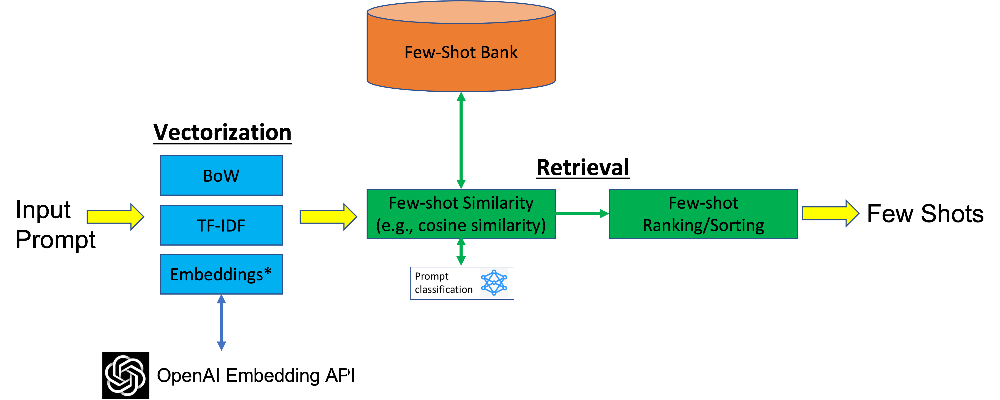

# Prompt Engineering

## What is Prompt Engineering?

Large language models (LLMs) have the ability to learn new tasks on the fly, without requiring any explicit training or parameter updates. This mode of using LLMs is called in-context learning, and it relies on providing the model with a suitable input prompt that contains instructions and/or examples of the desired task. The input prompt serves as a form of conditioning that guides the model's output, but the model does not change its weights. In-context learning can be applied in different settings, such as zero-shot, one-shot, or few-shot learning, depending on the amount of information that needs to be included in the input prompt.


*<p align="center">Figure 3: Different settings of in-context learning</p>*

The process of designing and tuning the natural language prompts for specific tasks, with the goal of improving the performance of LLMs is called **Prompt Engineering**.

Prompt engineering can significantly improve the performance of LLMs on specific tasks by providing instructions and contextual information that help guide the model's output. By carefully designing prompts, researchers can steer the LLM's attention towards the most relevant information for a given task, leading to more accurate and reliable outputs. Additionally, prompt engineering can help mitigate the problem of "catastrophic forgetting," where an LLM may forget previously learned information when fine-tuned on a new task. By using carefully designed prompts, the model can retain relevant knowledge while still adapting to new tasks.

One great resource with recommendations around prompt engineering is the [Prompt Engineering Guide](https://github.com/dair-ai/Prompt-Engineering-Guide).

## What Makes Up a Prompt?

While it is considered a new field, there is already a rich literature (e.g., articles, blogs, papers, repos, etc.) on prompt engineering techniques in which different types of contents can be included in the prompt. A comprehensive review of these methods and contents is out of the scope of this document. However, in this section we discuss a few widely-used methods/contents. The figure below also shows an illustrative example.


*<p align="center">Figure 4: An example showing some elements of a prompt.</p>*

### Instructions and other static context

Static context description refers to providing fixed information to the LLM. This information can include content and format instructions, database schema, or any other contextual information that is relevant to the task.  Herein we provide three widely used static context examples for prompt engineering:

- ***System message to inform LLMs conversational or functional style:***
  A system message can be used to inform the LLM about the type of conversation it is engaging in or the function it is supposed to perform. This helps the LLM generate more appropriate responses. For example, if the LLM is expected to perform a customer service function, the prompt could include a system message such as

  ```text
  You are a friendly AI agent who can provide assistance to the customer regarding their recent order.
  ```

  Similarly, if the LLM is engaging in a casual conversation, the prompt could include a message such as

  ```text
  Let's have a friendly chat about your favorite hobbies.
  ```

- ***Define expected completion formatting by formatting input text:***
By formatting input text in a specific way, we can guide the LLMs towards generating more relevant responses. For example, if the LLM is trained to generate recipe instructions, the input text could be formatted as "First, [action], then [action], and finally [action]." This formatting guides the LLM towards generating instructions in a sequential manner. Similarly, if the LLM is trained to generate summaries of news articles, the input text could be formatted as "The article talks about [topic]. It discusses [point 1], [point 2], and [point 3]." This formatting guides the LLM towards generating a summary that covers the main points of the article.
Other examples in static context formatting can be used in code generation applications. Here we can see the importance of using the correct comment character for the language that you want to generate.
*Prompt*:
`/* Create a javascript dictionary with 5 cities and their location */`
*Completion*:

    ```javascript
     var cities = {
    'Los Angeles': [34.0522, -118.2437],
    'New York': [40.7128, -74.0059],
    'San Francisco': [37.7749, -122.4194],
    'Chicago': [41.8781, -87.6298],
    'Houston': [29.7604, -95.3698]
    };
    ```

In this case we get a properly formatted javascript dictionary with the requested information.
Now, if you change "javascript" to python and leave the comment characters the same you get:
*Prompt*: `/* Create a python dictionary with 5 cities and their location */`
*Completion*:

  ```C+
    PyObject *pDict = PyDict_New();
    PyDict_SetItemString(pDict, "San Francisco", Py_BuildValue("(f,f)", 37.77493, -122.419416));
    PyDict_SetItemString(pDict, "New York", Py_BuildValue("(f,f)", 40.7127, -74.0059));
    PyDict_SetItemString(pDict, "London", Py_BuildValue("(f,f)", 51.507351, -0.127758));
    PyDict_SetItemString(pDict, "Paris", Py_BuildValue("(f,f)", 48.856614, 2.352222));
    PyDict_SetItemString(pDict, "Tokyo", Py_BuildValue("(f
    f)", 35.689487, 139.691706));
  ```

  Here we get C++ code making a python dictionary, because of the comment character being `/*` instead of `#`.

- ***Supporting information to enrich the prompt context:***
  Adding supporting information to the prompt can provide additional context for the LLM, which can improve the accuracy of its responses. For example, if the prompt asks the LLM to generate a response to a specific question, providing additional information such as the topic or the target audience can help the LLM generate a more relevant response. A good example would be:

  ```text
  Please explain transformer language model to a 15-year-old student.
  ```

  Similarly, if the LLM is prompted to generate a product description, providing additional information such as the product's features, benefits, and target market can help the LLM generate a more accurate and persuasive description. A good example would be:

  ```text
  Write a witty product description in a conversational style so young adult shoppers understand 
  what this product does and how it benefits them. 
  Use the following product details to summarize your description:

  Title: {{shopify.title}}
  Type: {{shopify.type}}
  Vendor: {{shopify.vendor}}
  Tags: {{shopify.tags}}
  ```

### Task-specific knowledge enrichment (data augmented generation)

Prompt engineering by task-specific knowledge enrichment involves retrieving relevant knowledge from a large corpus of text and incorporating it into the prompt to improve the performance of language models. This is also known as **Data Augmented Generation**. One way to achieve this is through a knowledge retrieval strategy that involves chunking and indexing bulk knowledge context, followed by embedding similarity context selection. Here's how this approach works:

- Importing knowledge data from data sources as document store.
Multiple data sources could be used to build knowledge document store. For example, you could import car reviews from websites such as Edmunds and Consumer Reports, technical manuals in pdf format from car manufacturers, or news articles from sources such as Reuters and CNN. Each of these data sources would be represented as a separate document within the document store.
- Chunking the text into smaller, possibly overlapping and more manageable segments.
The chunk can be implemented by a static size of token (ex, 1000). The chunk size is usually defined by considering token size limit of LLMs model inference. It can also be carried out by embedded titles, topics, or natural paragraph styles in the knowledge data.
- Embedding generation / indexing for efficient retrieval.
The final step is to generate embeddings and index the segmented text for efficient retrieval. This involves representing each segment as a vector or a set of features that capture its key semantic attributes. For example, you could generate embeddings using a pretrained language model (ex., BERT, text_embedding-ada-002) and save it as a vector store. Next, an index is created that maps each embedding to the corresponding document, which would allow you to quickly retrieve all the documents that contain relevant information based on their similarity to the query embedding.
- Retrieval of relevant context (e.g., chunks).
Once the knowledge base has been chunked and indexed, the next step is to select the most relevant pieces of information to incorporate into the prompt. One approach to do that is by semantic search. Specifically, by comparing the embeddings of the indexed knowledge segments with the embeddings of the input prompt to identify the most similar pieces of information.

This method of prompt engineering by task-specific knowledge enrichment can be highly effective in improving the accuracy and relevance of LLM responses. By incorporating relevant knowledge into the prompt, the LLM can generate more informed and accurate responses, which can enhance the user's experience and increase the effectiveness of the system. The following figure provides one example of task-specific knowledge enrichment architecture design.


*<p align="center">Figure 5: An example of task-specific knowledge enrichment architecture design</p>*

### Few-shot examples

Few-shot examples involve providing a small number of input and output examples (input-output pairs) to the LLM to guide its completions in both content and format. One simple example would be for classification, such as the following:

```text
apple: fruit
orange: fruit
zucchini: vegetable
```

Now, if we want to know if a tomato is a fruit or vegetable, we include this few-shot example prior to input:

```text
apple: fruit
orange: fruit
zucchini: vegetable
tomato:
```

To which the LLM (e.g, GPT-3) responds with "fruit".

The previous example is a case of static few shot example, where no matter what object we are trying to classify, the same examples are used. However, there are cases where we may want to pick different few shot examples dynamically based on the input prompt. To do that, a library/bank of few-shot examples is created, where each example is represented in a feature space (e.g., embeddings using a pre-trained model). Then, when a new prompt is presented, the few-shot examples that are most similar in that feature space are selected to guide the language model. This method is useful when the few-shot bank data is large and diverse, and when the examples share common underlying patterns. For example, if the few-shot bank data consists of various examples of restaurant reviews, using embeddings can capture similarities in the language used to describe the quality of food, service, and atmosphere, and the most similar examples can be used to optimize the language model inference.  

The [few_shot_embedding_component](../../components/pre_processors/few_shot_embedding.py) implements this technique.

There are different techniques to improve/optimize the dynamic few-shot selection further. One approach is to filter or categorize the examples in the few-shot bank for faster retrieval of more relevant examples. To do that, the few-shot bank examples are labeled using intentions or tasks. A custom model can be trained to classify those examples. (e.g., sports, entertainment, politics, etc.). When a new prompt is presented, the classifier is used to predict the task or intention of the prompt. Then, the few-shot examples that are most relevant to the predicted task are selected to instruct the language model inference. The following figure provides an example of architecture design for dynamic few-shot example retrieval by leveraging embedding similarity or intention prediction classifier method.


*<p align="center">Figure 6: An example of architecture design for dynamic few-shot example retrieval.</p>*

### History

Prompt engineering using session history involves tracking the history of a conversation between the user and the language model. This method can help the language model generate more accurate responses by taking into account the context of the conversation. Here's an example of how LLMs track the history of conversation to help generate accurate responses:

```text
User: The capital of India?
LLM: The capital of India is New Delhi.
User: What is the population of this city?
LLM: As of 2021, the estimated population of New Delhi is around 31.8 million people.
```

In this scenario, the LLM is able to use the history of the conversation to understand “this city” refers to “New Delhi”.

Another example takes the following multi-turn NL2Code interaction where the user's requests follow the `#` comment character and the model's code follows on a new line.

```python
# Add a cube named "myCube"
cube(name="myCube")

# Move it up three units
move(0, 5, 0, "myCube")
```

For the second request ("Move it up three units") the model is only able to generate the correct completion because the previous interaction is included.

One helpful trick for deciding if you need a session history is to put yourself in the place of the model and ask yourself "Do I have all of the information I need to do what the user wants?"

The [session_selector component](../../components/pre_processors/session_selector.py) includes previous examples from the same session.

## Challenges and limitations of prompt engineering

While prompt engineering can be a useful approach to improve the accuracy and effectiveness of LLMs inference results, it is not without its challenges and limitations. Herein we summarize a few major challenges in prompt engineering.

- **Token size limit for prompt input:** Most LLMs have a limit on the number of tokens that can be used as input to generate a completion, which can be as low as a few dozen tokens. This can limit the amount of context that can be used to generate accurate completions.
- **Data for prompt engineering are not always available:** For example, prompts may require domain-specific knowledge or language that is not commonly used in everyday communication. In such cases, it may be challenging to find suitable data to use for prompt engineering. Additionally, the quality of the prompts can also be affected by the quality of the data used for prompt engineering.
- **Increasing the complexity of the solution.** As the number of prompts increases, it becomes more difficult to keep track of the various experiments and to isolate the impact of the prompts on the final output. This can lead to confusion and make it more challenging to draw meaningful conclusions from the experiments.
- **Introduce additional latency and costs.** Generating high-quality prompts requires time and resources, and this can slow down the overall process of model development and deployment. Additionally, more complex prompts can significant increase the prompt token size in each LLMs calling, which can increase the cost of running experiments.
- **Small changes to the prompts can result in very different outputs.** This can make it difficult to predict how the model will behave in different situations and can lead to unexpected results. It becomes particularly problematic in applications where accuracy and consistency are critical, such as in automated customer service or medical diagnosis.
