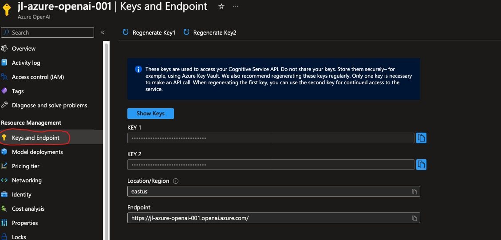

# OpenAI Labs

## Goals

Provide a set of exercises to familiarize user with Azure OpenAI Service.  Repository includes setup for a dev container which is configured to execute all necessary OpenAI exerices.  

## Prerequisites

- An Azure subscription - [Create one for free](https://azure.microsoft.com/free/cognitive-services)
Apply for access to Azure OpenAI: <https://aka.ms/oaiapply>
- Access granted to Azure OpenAI in the desired Azure subscription
  Currently, access to this service is granted only by application. You can apply for access to Azure OpenAI by completing the form at <https://aka.ms/oai/access>.
- An Azure OpenAI resource
  For more information about creating a resource, see [Create a resource and deploy a model using Azure OpenAI](https://learn.microsoft.com/en-us/azure/cognitive-services/openai/how-to/create-resource).

## Configure environment

Create .env file with your OpenAI API key, model to be used, api URL, and API version, this will be used in the labs to set up the key for the jupyter notebooks - they use dotenv to load secrets and user specific settings.
  
```bash
echo "OPENAI_API_KEY='<OpenAI key goes here>'
CHATGPT_MODEL='<model name goes here>'
OPENAI_API_BASE='<service url goes here>'
OPENAI_API_VERSION='<api version goes here>'" > .env
```
> **Note**
> These values can be found in the Azure Portal by navigating to your Azure OpenAI resource
> 

## Run Jupyter Notebook

Running jupyter notebook from a terminal at the top level directory for this repository will start a jupyter server and allow you to interact with any notebooks in the repository.

```bash
#run this command from terminal
jupyter notebook
```

Instructions on how to access newly started Jupyter instance will show up in the terminal, you can also see more details here:
<https://docs.jupyter.org/en/latest/running.html>
